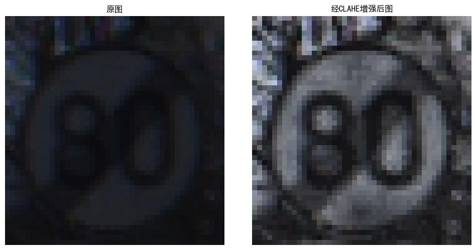
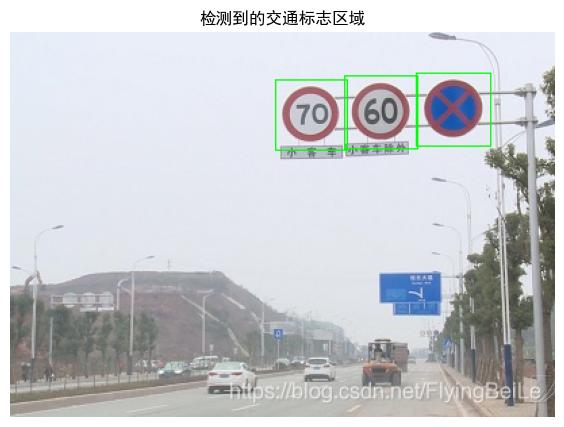

# 基于CLAHE增强和LeNet的交通标志识别系统

## 项目简介

本项目实现了一个完整的交通标志识别系统，主要包含以下功能：
- 基于LAB颜色空间的CLAHE图像增强预处理
- 目标定位与图像切割
- 使用LeNet卷积神经网络进行交通标志分类
- 基于PyQt5的图形用户界面

## 效果展示
 

*注：上方为同一交通标志图像在CLAHE增强前后的对比效果*

## 目标定位与切割
- 对增强后的图像进行目标检测定位
- 绘制方框标记交通标志位置
- 根据方框坐标切割出感兴趣区域（ROI）

 

## 数据集

本项目使用GTSRB（German Traffic Sign Recognition Benchmark）数据集，包含43类交通标志：

- 训练集：[GTSRB_Final_Training_Images.zip](https://sid.erda.dk/public/archives/daaeac0d7ce1152aea9b61d9f1e19370/GTSRB_Final_Training_Images.zip)
- 测试集：[GTSRB_Final_Test_Images.zip](https://sid.erda.dk/public/archives/daaeac0d7ce1152aea9b61d9f1e19370/GTSRB_Final_Test_Images.zip)
- 测试集标注：[GTSRB_Final_Test_GT.zip](https://sid.erda.dk/public/archives/daaeac0d7ce1152aea9b61d9f1e19370/GTSRB_Final_Test_GT.zip)

